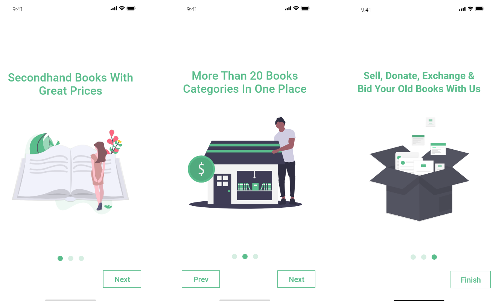
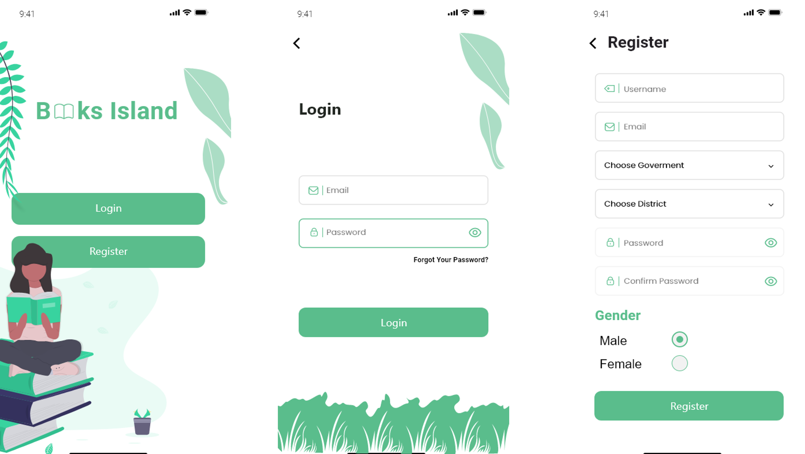
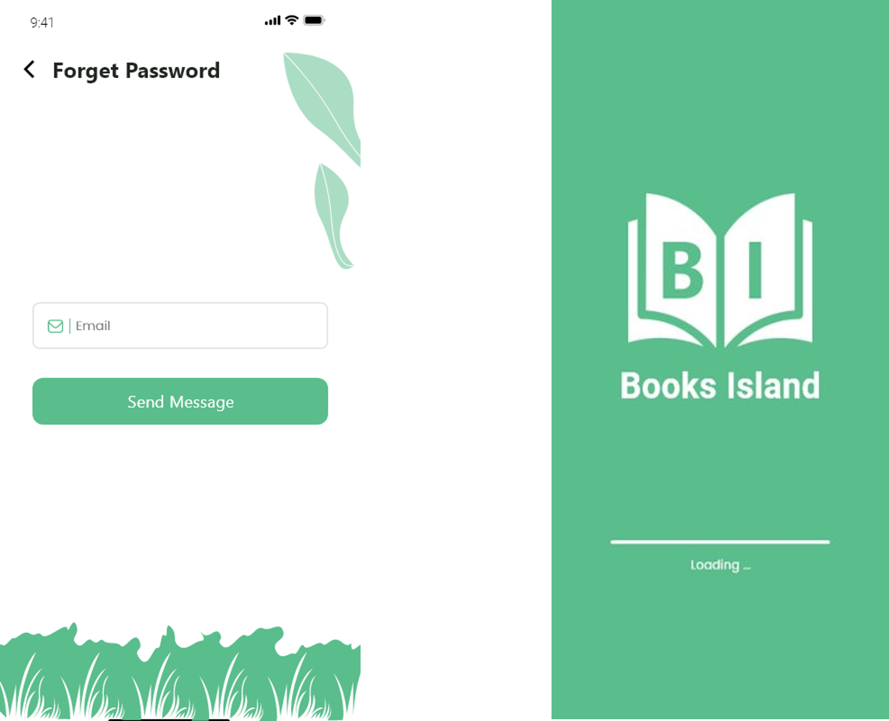
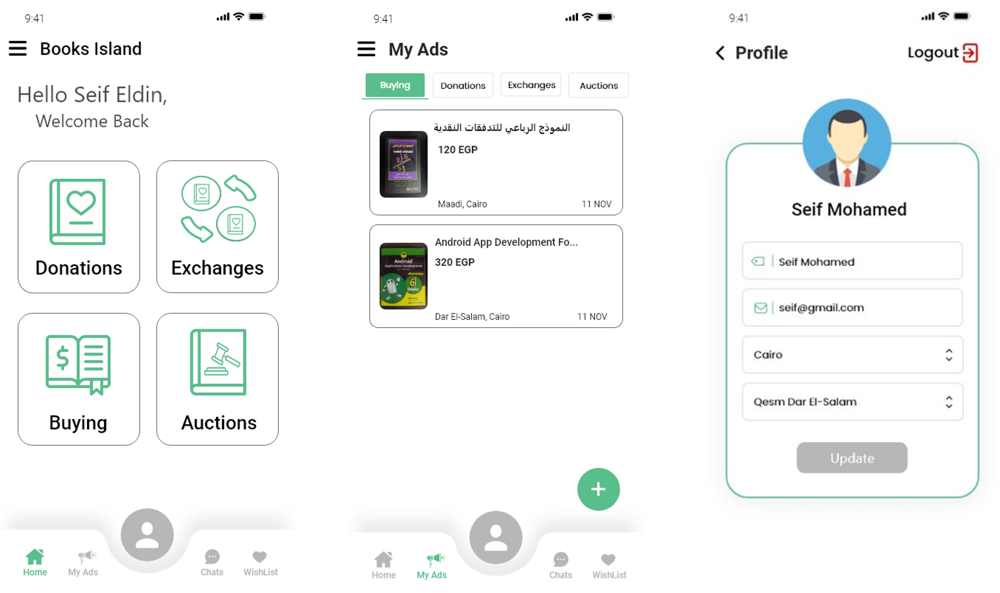
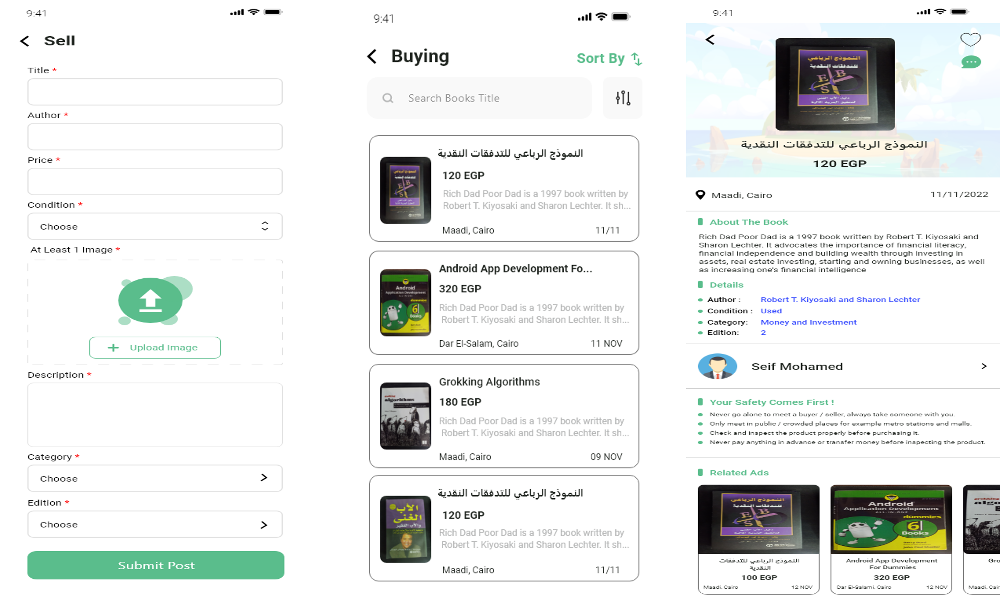
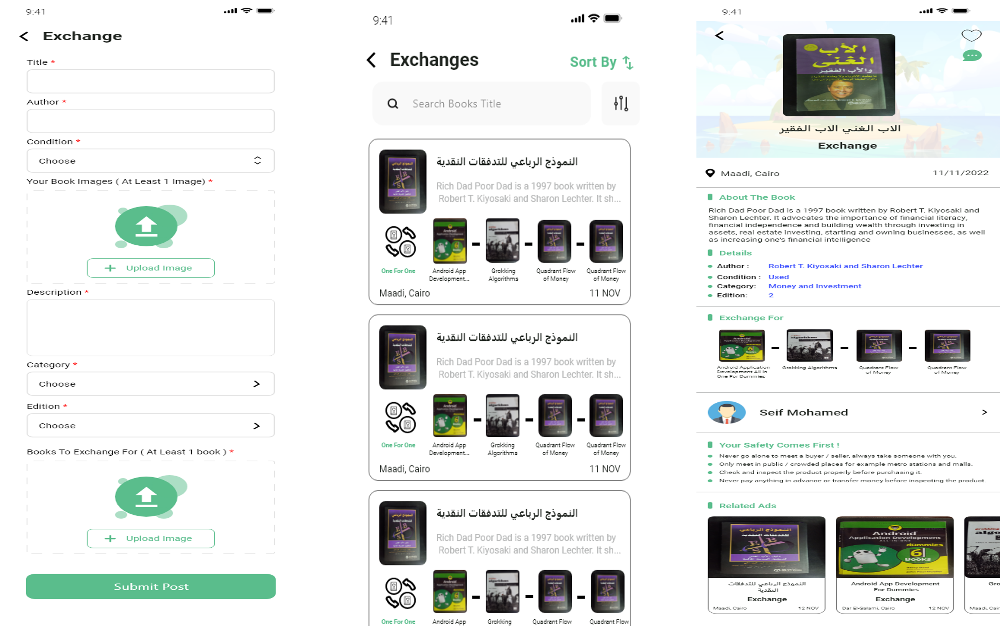
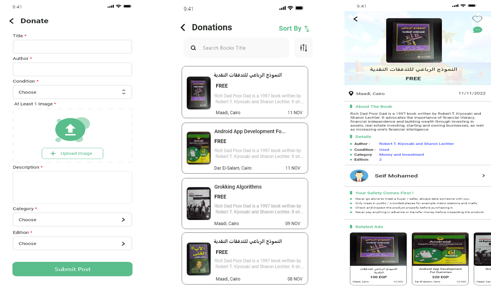
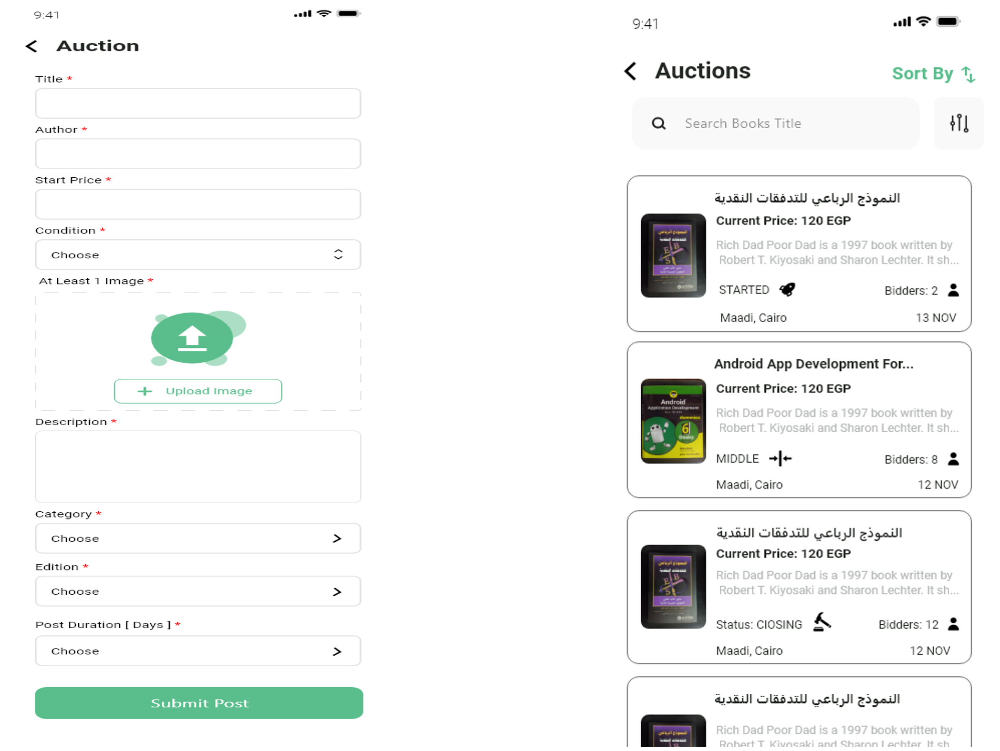
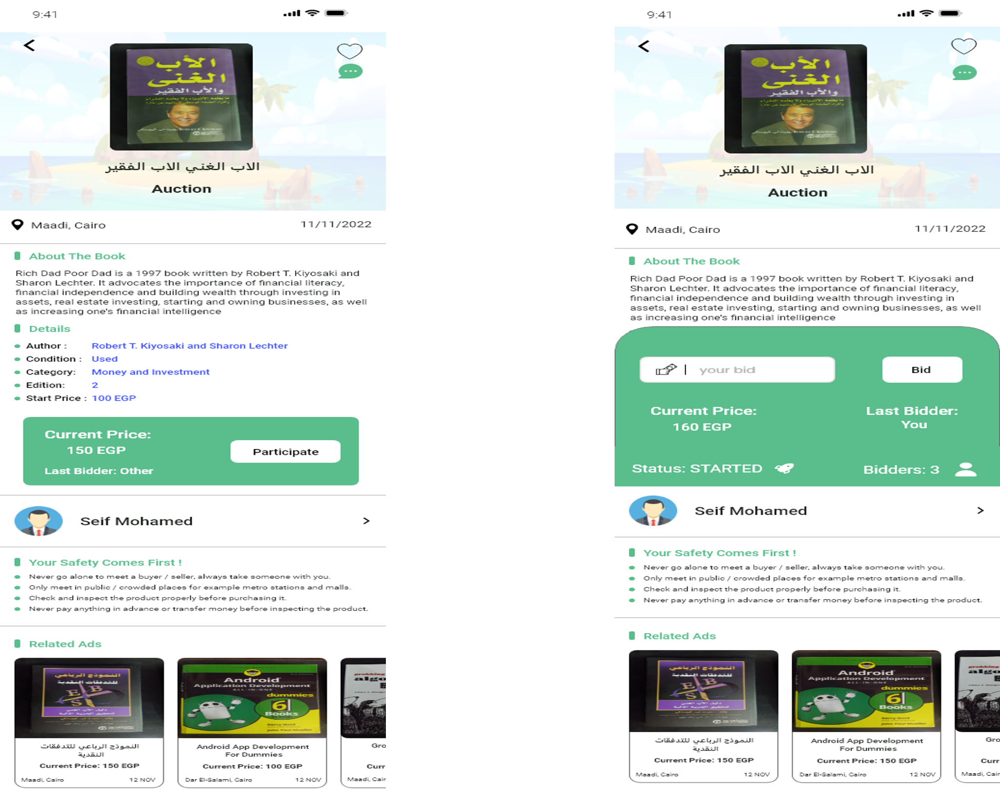

# Books Island App

# Description
Books Island is an Android application that offers the users four types of advertisements: buying, donations, exchanges, or auctions. 
The app's main goal is to make use of used or new books that would otherwise be thrown away by allowing 
people to sell, donate, exchange, or auction them at low prices. This way, individuals with low income 
can afford to rekindle their love of reading by obtaining books for affordable prices. Additionally, 
the platform aims to increase awareness within society about the benefits of recycling books 
and the importance of access to reading material.

# Features:
1- Sort the todos by its priority. 
2- Search by todo title. 
3- Edit the todo content or priority. 
4- Delete the todo. 
5- Share your tasks with your friends. 

# Built with:
• Kotlin 
• MVVM Clean Architecture 
• Firebase ( Authentication, Firestore, Database, Cloud Messaging, Analytics, Crashlytics ) 
• Hilt 
• Coroutines 
• Navigation Component 
• State Flow 
• Coil 
• Shared Preference 
• Timber and Logger 
• Lottie Animation 
• Recycler View + Diff Util 
• Mockito and Mockk 
• Espresso 

# Screen Shots

